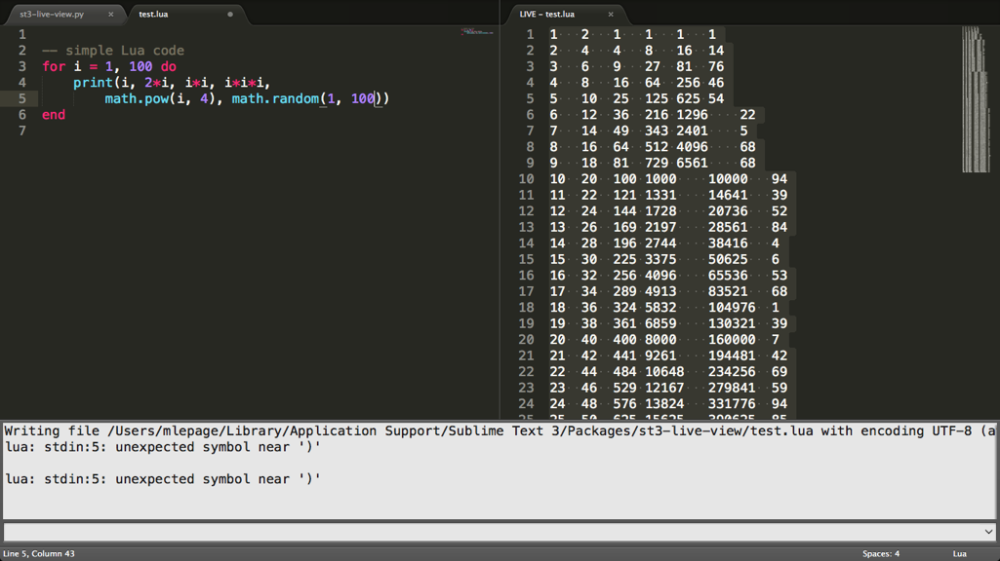

Sublime Text 3 Live View Plug-In
================================

Live View is a plug-in for [Sublime Text 3][ST3] written by Marc Lepage.

It allows a view to have a corresponding "live" view which continuously displays the results of executing a command using that view's contents as input.

For example, you can see live output from running a script as you edit it.

[ST3]: http://www.sublimetext.com/

Getting Started
---------------

Install the __st3-live-view__ directory into Sublime Text 3's __Packages__ directory:

- __Mac OS X:__ ~/Library/Application Support/Sublime Text 3/Packages
- __Linux:__ ~/.config/sublime-text-3/Packages
- __Windows:__ %APPDATA%\Sublime Text 3\Packages

You may have to edit the __cmd__ variable at the top of the __st3-live-view.py__ file to specify the desired executable or provide a full path or optional arguments. This command will be used with [subprocess.Popen][POPEN] so consult those docs for further information.

In Sublime Text 3, show the console either view the view menu or by using ctrl-backtick.

Focus a view for which you want live output while editing.

Type this in the console to open the live view:

    view.run_command('lv_open')

When done, simply close the live view. It can also be closed from its original view using this command:

    view.run_command('lv_close')

These commands can be bound to keys, see the [key bindings documentation][KEYS] for instructions.

[POPEN]: http://docs.python.org/2/library/subprocess.html#popen-objects
[KEYS]: http://www.sublimetext.com/docs/key-bindings

Tutorial
--------

Assume Live View is configured for running [Lua][LUA] code.

In a new view, type in this simple loop which prints four ordinal numbers, their doubles, and their squares:

    for i = 1, 4 do
        print(i, 2*i, i*i)
    end

Open a corresponding live view, producing this output:

    1   2   1
    2   4   4
    3   6   9
    4   8   16

Now in the original view select the __2__ and change it to __3__, instantly producing this output with the center column changed from doubles to triples:

    1   3   1
    2   6   4
    3   9   9
    4   12  16

Now suppose we also want to print out another column with the cube of each number.

In the print statement, just before the closing parenthesis, type these characters one at a time:

    , i*i*i

As soon as you type the __comma__, the code will become invalid and two things will happen.

First, the live view's title will change from "LIVE" to "live" to denote that the output is out of date.

Second, the console will display the error:

    lua: stdin:2: unexpected symbol near ')'

Typing the __space__ won't change the error state; the live view will remain stale.

The next character typed, __i__, will suddenly result in valid code and two things will happen.

First, the live view's title will change from "live" to "LIVE" to denote that the output is once again live.

Second, the live view will show the updated output with a fourth column of ordinal numbers:

    1   3   1   1
    2   6   4   2
    3   9   9   3
    4   12  16  4

As you type the next __*__ __i__ __*__ __i__ characters the live view will alternate between stale and up to date. The fourth column will show squares then finally cubes:

    1   3   1   1
    2   6   4   8
    3   9   9   27
    4   12  16  64

Try changing the loop control variables to output more or less numbers with different ranges. For example, iterating from 1 to 10 will produce:

    1   3   1   1
    2   6   4   8
    3   9   9   27
    4   12  16  64
    5   15  25  125
    6   18  36  216
    7   21  49  343
    8   24  64  512
    9   27  81  729
    10  30  100 1000

[LUA]: http://www.lua.org/

License
-------

Live View is licensed under the [MIT License][MIT].

[MIT]: http://en.wikipedia.org/wiki/MIT_License
